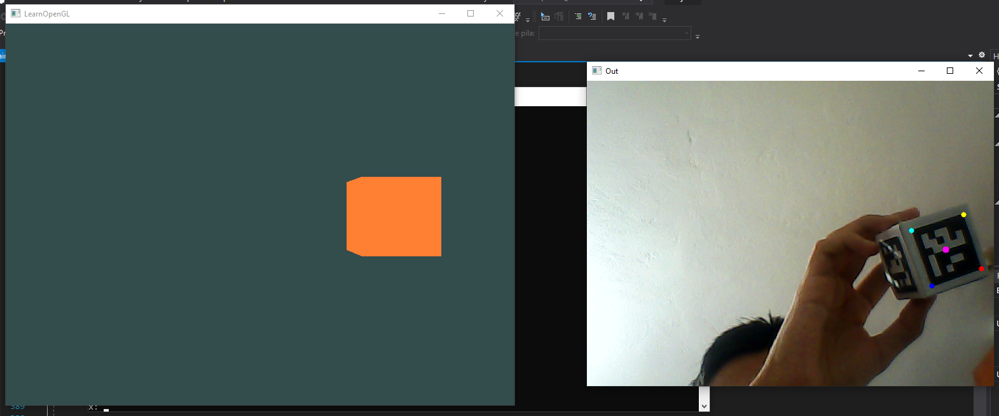
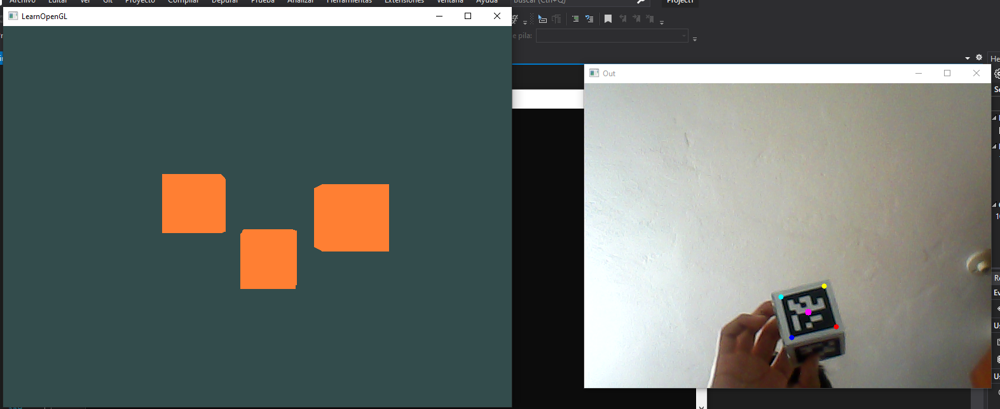

# Tópicos de computación gráfica: Proyecto final
# ArucoPointDraw: Dibujo en 3D con ArUco
* En el presente trabajo se representan los marcadores ArUcO en el entorno de OPENGL.
* Se utiliza un cubo que está conformado de marcadores ArUco, donde en base a esos marcadores se encuentra el punto medio (para calcular el punto medio se tomó como referencia el trabajo de [Cube-Pose-Estimation-with-ArUco](https://github.com/Hydran00/Cube-Pose-Estimation-with-ArUco)).
* Transformamos las coordenadas del cubo y se lo pasamos como coordenadas de posición en el entorno OPENGL.

## Tecnologías usadas
1. Visual Studio 2019/2022
2. OpenCV - 4.8.0 /ArUco
3. GLFW - 3.3 & glad - 0.1.34
4. Glm - 0.9.9.9

## Resultados

  

  

